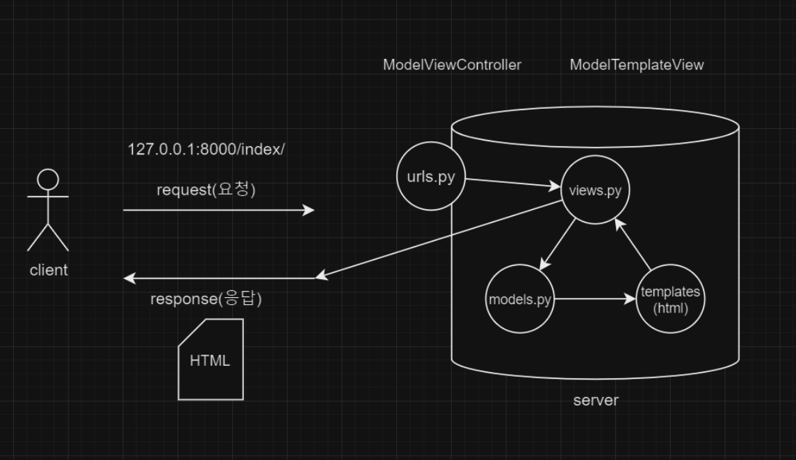

# django

1. 프로젝트 생성
```
django-admin startproject <pjtname>.
```

2. 가상환경 설정
```
python -m venv venv
```

3. 가상환경 활성화/비활성화
```
<!-- window -->
source venv/Scripts/activate
<!-- macOS -->
source venu/bin/activate

deactivate
```

4. 가상환경 내부에 django 설치
```
pip install django
```

5. 서버 실행 확인(종료 `ctrl + c`)
```
python manage.py runserver
```

6. 앱생성
```
django-admin startapp <appname>
```

7. 앱등록
- `settings.py`의 `INSTALLED_APPS`에 등록
    `<appname>`을 등록

8. `urls.py`
```python
from django.urls import path
from app_intro import views

urlpatterns = [
    ...
    path('index/', views.index),
]
```

9. `view.py`
```python
def index(request):
    return render(request, 'index.html')
```

10. template폴더 생성 => index.html 생성

## MTV


